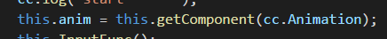
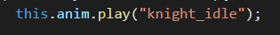
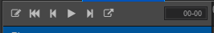
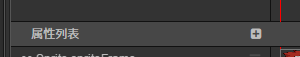
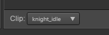
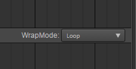
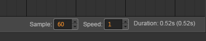

# CocosCreatorBlog
关于CocosCreator学习的随笔札记

Animation：
---------
在资源目录下创建一个新的clip时要注意，要把这个clip挂载到一个Animation组件上才能进行编辑。
如果一个物体需要使用代码去播放多个clip动画片段，那么你需要将这些片段都挂载到相应物体的Animation组件的Clip数组中。
 类似： 

当需要代码去控制播放动画clip时: 
首先需要获取到Animation组件，如下： 

 

 
然后需要调用Play函数，如下： 

 Paly函数是一个重载函数，有多重参数可以选择,比如Play("test",1)这说明播放test这个clip片段，不过是要从1秒处开始，具体可以参考官方文档。 

当对clip进行编辑时，需要注意几个参数： 

开始编辑clip时，需要先点击第一个按钮

最后面的00-00是表示当前帧所在的时间位置，比如01-05，解释为：1秒+5/60(默认帧率为60) 也就是说从播放开始过了那么久到该帧所在的位置。

属性列表，点击+号可以选择挂载Animation组件的node节点上可以用于clip的属性。

这是当前clip片段，如果Animation组件上clip数组里有多个，那么这个下拉列表就有多个，否则只能选择当前的clip。

这是关于clip播放模式的一些基础选择，比如单次，循环，pingpong等

sample是帧率，可调；sped是播放速度；duration是当动画播放速度为 1 的时候，动画的持续时间。
