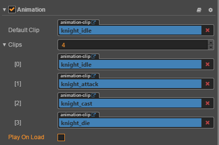

# CocosCreatorBlog
关于CocosCreator学习的随笔札记

Animation：
---------
在资源目录下创建一个新的clip时要注意，要把这个clip挂载到一个Animation组件上才能进行编辑。
如果一个物体需要使用代码去播放多个clip动画片段，那么你需要将这些片段都挂载到相应物体的Animation组件的Clip数组中。
 类似： 

 
当需要代码去控制播放动画clip时: 
首先需要获取到Animation组件，如下： 

 然后需要调用Play函数，如下： 

 Paly函数是一个重载函数，有多重参数可以选择,比如Play("test",1)这说明播放test这个clip片段，不过是要从1秒处开始，具体可以参考官方文档。 

当对clip进行编辑时，需要注意几个参数： 
